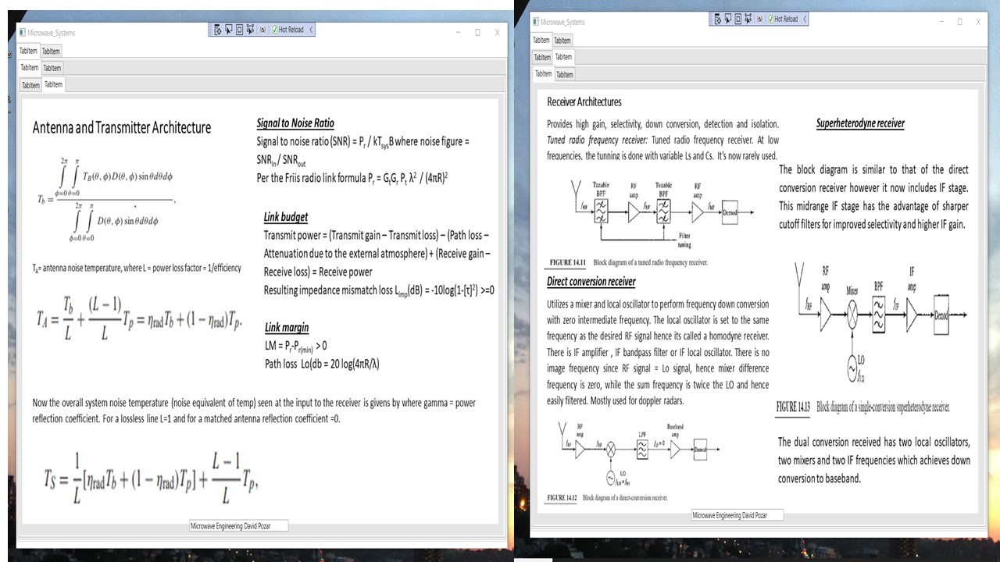

# RFDesign

The project provides an introduction to the RF Design 

Confidential information is not displayed. References are provided for the non-custom images. 

Please download the executable in https://github.com/alpaddesai/RFDesign/releases for details.

## RF Design 

## Impedance Matching

## Microwave Network Analysis

![image]](Slide1.JPG)
![image]](Slide2.JPG)

## Microwave filters

## Power Dividers and Couplers

## Noise and power equivalent temperature

## Modulation Techniques

## Second harmonics 

## Mixer

## Oscillator

## Amplifier

## Transceiver Architecture

